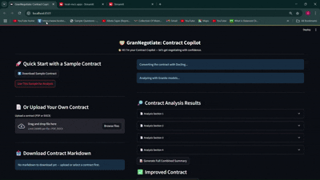
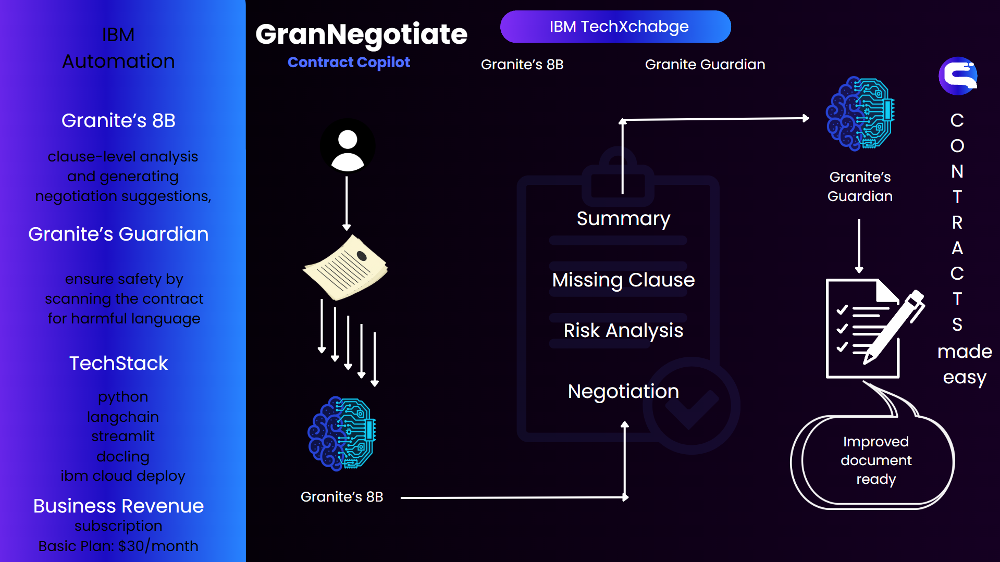
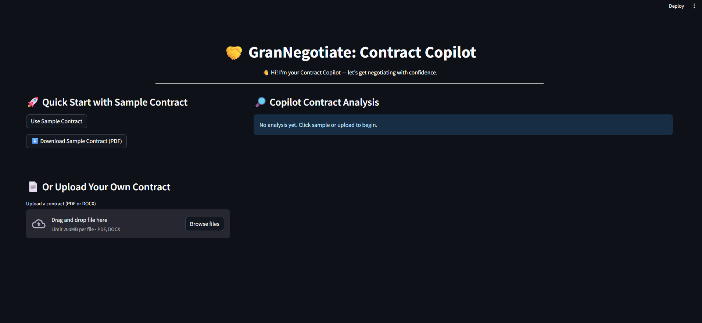
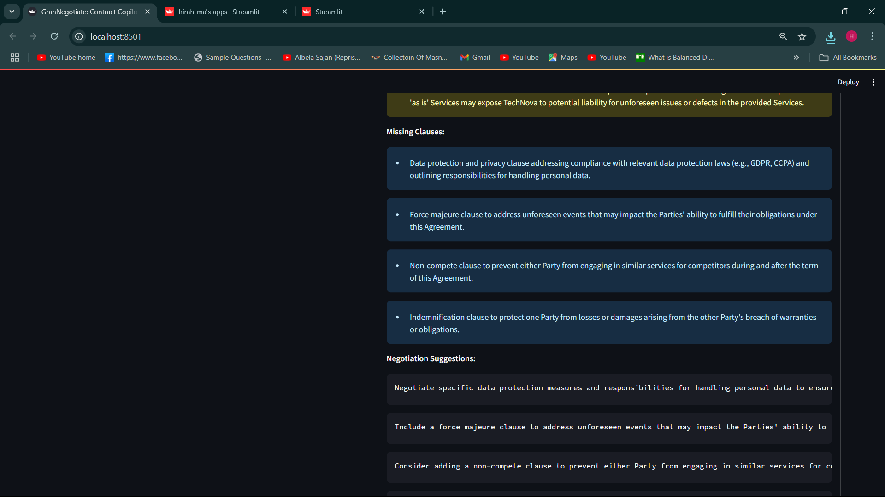
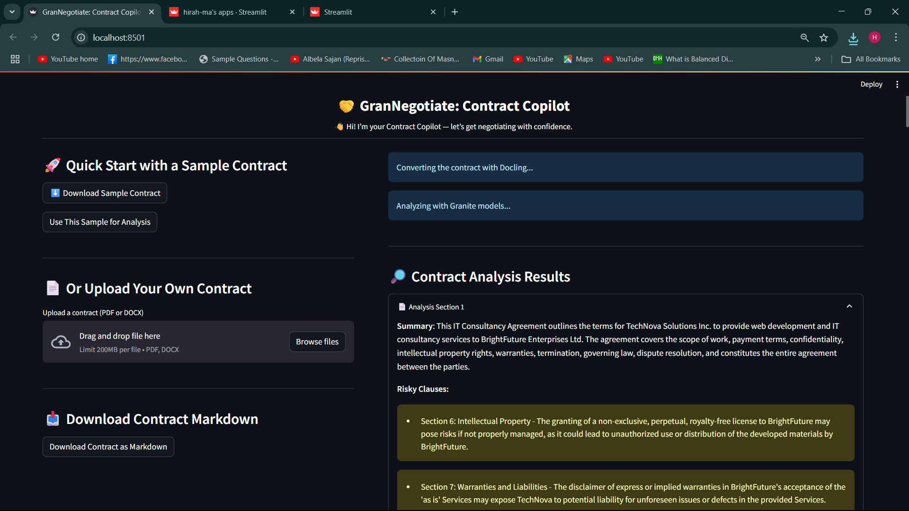

# GranNegotiate: Contract Negotiation Copilot

[](https://grannegotiate-contract-copilot-xxdyfyxpb6r3p7rjj5dctk.streamlit.app/)  
**[👉 Click here to try the app live](https://grannegotiate-contract-copilot-xxdyfyxpb6r3p7rjj5dctk.streamlit.app/)**

---

## Demo Screenshots

|  |  |
| -------------------- | -------------------- |
|  |  |


---

## Problem Statement

Contract negotiation is often a slow, manual, and complex process that involves interpreting lengthy documents, understanding legal terminology, and making decisions about terms that can impact a company's operations. Traditional methods are time-consuming, prone to human error, and require significant expertise. GranNegotiate aims to automate the analysis and negotiation process by helping businesses efficiently review and negotiate contracts with the help of AI.

---

## Solution

GranNegotiate is a web-based application that streamlines the contract negotiation process. By leveraging IBM Granite and Granite Guardian models, our solution automatically analyzes contract clauses, highlights potential issues, and provides actionable insights for negotiation. Users can either upload a contract or use a sample contract, and the tool will provide suggestions for improvements based on the analysis.

---

## Features

- **Contract Upload**: Upload PDFs or DOCX files.  
- **Sample Contract**: Quick start with a pre-loaded sample contract.  
- **Clause-Level Analysis**: Breaks down the contract into smaller chunks for easier analysis.  
- **Negotiation Suggestions**: Provides actionable recommendations for improving contract terms.  
- **Compliance Check**: Identifies any missing or non-compliant clauses.  
- **Safer Contracts**: Generates a safer, improved version of the contract for the user.

---

## IBM Granite Models Used

- **Granite-3-3-8b-Instruct**: Used for clause-level analysis of the uploaded contract, to understand the contract's language and context, identify risks, and highlight key clauses.  
- **Granite Guardian**: Performs a safety check on the contract, flagging any potentially harmful or abusive language and ensuring compliance with ethical and legal standards.

---

## Architecture

**Frontend:**
- Built with Streamlit to provide a simple, intuitive, and interactive user interface.

**Backend:**
- LangChain for splitting and chunking large contracts into manageable sections.
- IBM Granite API for contract analysis.
- Granite Guardian for safety and compliance checks.

**Workflow:**
1. The user uploads a contract or uses a sample contract.
2. The contract is split into smaller chunks for analysis.
3. The contract is analyzed using IBM Granite models.
4. The user receives detailed feedback, including risky clauses, missing clauses, negotiation suggestions, and compliance checks.
5. The user can download an improved version of the contract in markdown format.

---

## How It Works

- **Contract Upload**: Upload your own contract in PDF or DOCX, or use a sample contract.  
- **Conversion**: Converts the contract to markdown for analysis.  
- **AI Analysis**: Uses IBM Granite to break the contract into chunks and provide negotiation suggestions and highlights.  
- **Download Markdown**: Download the improved version after analysis.

---

## Key Features

- Clause-Level Breakdown
- Granular Feedback with risks, missing clauses, suggestions, and compliance
- Safer, improved contract drafts for download

---

## Technologies Used

- Streamlit
- IBM Granite
- LangChain
- Granite Guardian

---

## Example Workflow

1. Upload or select a sample contract  
2. The app processes and analyzes the content  
3. Suggestions for improvement are generated  
4. You can download an improved version of the contract in markdown

---

## Installation

```bash
git clone https://github.com/your-repository.git
cd GranNegotiate
pip install -r requirements.txt
streamlit run app.py
```

---

## Conclusion

GranNegotiate helps businesses optimize their contract negotiation process by leveraging AI to analyze contracts, offer suggestions, and ensure compliance. With IBM Granite and Granite Guardian, we automate tedious and time-consuming contract review tasks — providing safer, clearer contracts for your organization.

